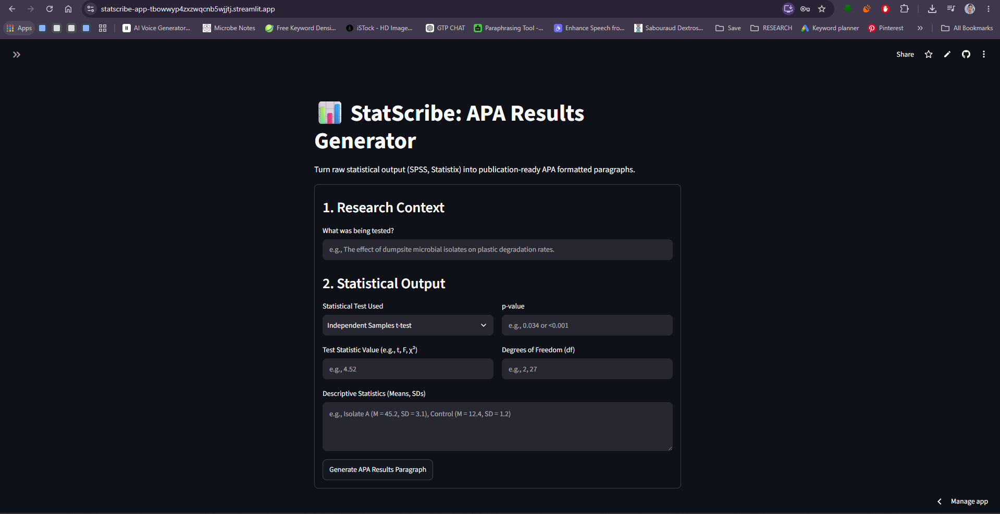
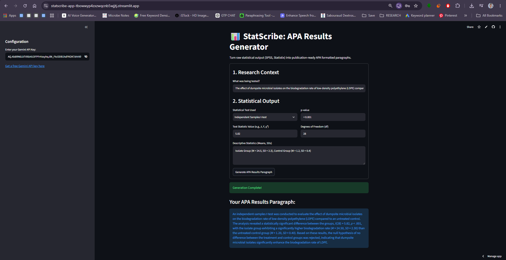
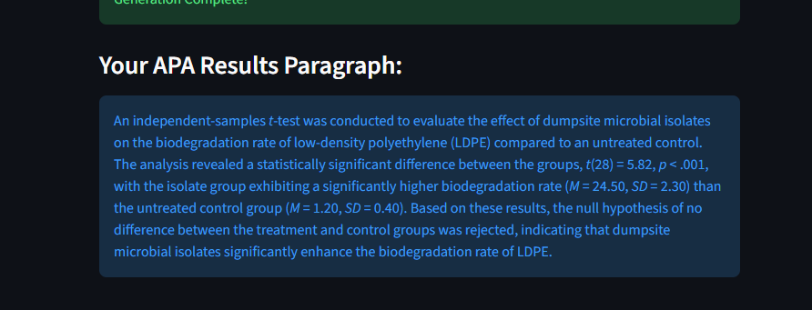

# StatScribe: APA Results Generator

## a. Overview
StatScribe is a web application designed to bridge the gap between raw statistical software output and publication-ready academic writing. 
**The Problem:** Researchers and data analysts often spend unnecessary time formatting raw outputs (from software like SPSS or Statistix) into the strict narrative structure required by the APA (American Psychological Association) 7th Edition guidelines. Formatting errors in statistical reporting are a leading cause of manuscript revisions.
**Target Audience:** M.Phil/Ph.D. scholars, academic researchers, and freelance data analysts.

## b. Live Application
**URL:** https://statscribe-app-tbowwyp4zxzwqcnb5wjjtj.streamlit.app/

## c. Features List
*   **Methodology Selection:** Dropdown menus supporting 7 different parametric and non-parametric statistical tests.
*   **Variable Extraction:** Dedicated input fields for test statistics, p-values, degrees of freedom, and descriptive data.
*   **AI-Powered Narrative Formatting:** Instantly generates a cohesive, academically rigorous paragraph adhering to strict APA formatting standards (including correct italicization of statistical symbols).
*   **Bring-Your-Own-Key (BYOK):** A secure sidebar input allowing users to use their own Gemini API key, preventing hardcoded secret leaks.

## d. The AI Feature
**What it does:** The AI acts as an academic data analyst. It takes the fragmented numerical inputs, evaluates significance based on the provided p-value, and constructs a methodologically sound results paragraph.
**System Prompt/Instructions:** 
> "You are an expert academic data analyst. The user has conducted a {test_type} to investigate the following: {research_q}. Here are the raw statistical outputs: Test Statistic: {test_statistic}, Degrees of Freedom: {degrees_freedom}, p-value: {p_value}, Descriptive Statistics: {descriptive_stats}. Task: Write a single, highly professional paragraph reporting these results in strict 7th Edition APA format. Ensure statistical symbols are italicized using Markdown. State clearly whether the null hypothesis is rejected or accepted based on the p-value. Do not add any filler text."

## e. Tech Stack
*   **Frontend & Backend Interface:** Python with Streamlit
*   **AI Model:** AI Model: Google Gemini 3.6 Flash (via `google-generativeai` SDK)
*   **Hosting & Deployment:** Streamlit Community Cloud linked to GitHub

## f. Screenshots
**1. Initial Interface**

**2. Form Input and API Key**

**3. AI-Generated APA Output**

## g. How to Run Locally
1. Clone the repository: `git clone https://github.com/mahrukhsaeed1998/statscribe-app.git`
2. Navigate into the directory: `cd statscribe-app`
3. Install dependencies: `pip install -r requirements.txt`
4. Run the app: `streamlit run app.py`
5. Get a free Gemini API key from Google AI Studio and paste it into the app sidebar.
